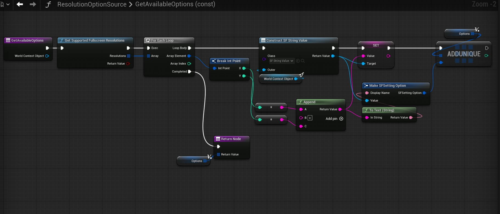
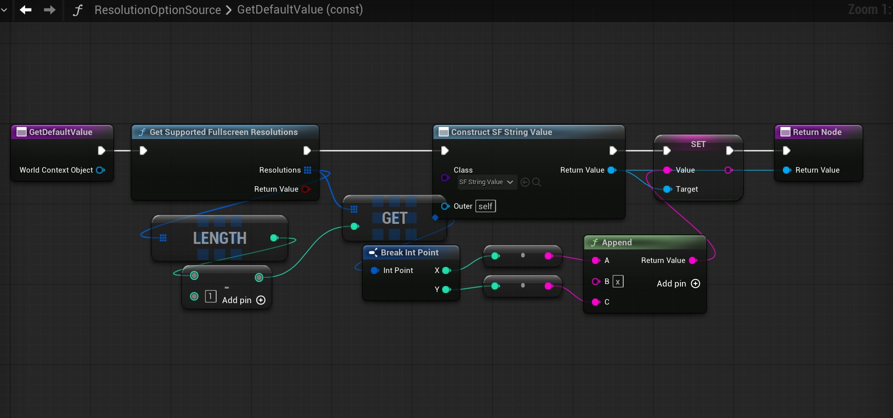
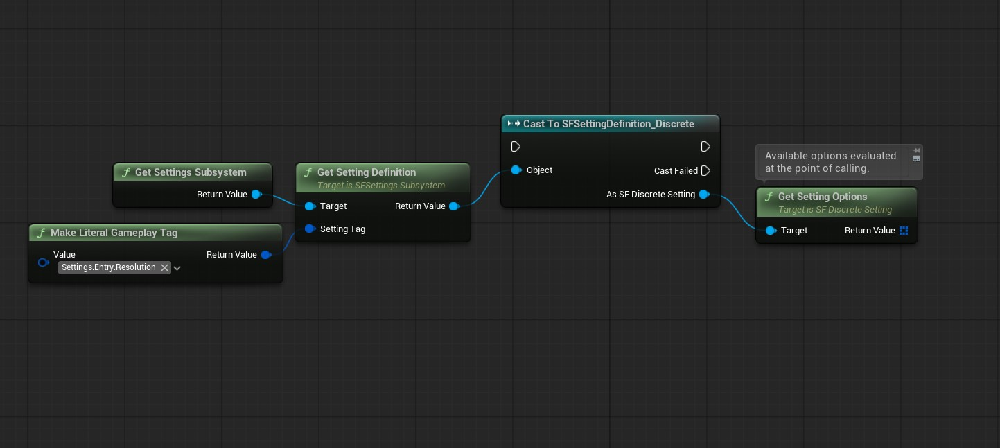

# Settings Framework Plugin: Setup Guide

This guide provides step-by-step instructions on how to set up a Blueprint-only project after installing the plugin. 

You can reference the [Blueprint-only demo project download](https://drive.google.com/file/d/156jxQw5HtAuOoWHPHGP7tj9XtrXvDl1e/view?usp=sharing) as you work. Download the Settings Framework plugin from Fab and copy its contents to `BPDemo/Plugins/SettingsFramework` to make the project functional. The plugin's contents include the following:

* Folders: `Binaries`, `Content`, `Resources`, `Source`.
* Files: `SettingsFramework.uplugin`, `README.md`.

---

## 1. Defining Settings and Categories

* To define a setting, navigate to the Content Browser, right-click, and select **Miscellaneous** > **Data Asset**. Choose between `SF Bool Setting`, `SF Discrete Setting`, `SF Keybind Setting`, or `SF Scalar Setting` based on your project's needs. 
* All settings share common fields, such as Setting Tag, Display Name, and Description. 
* Each setting type also includes type-specific fields for further customization. For example, the `SF Scalar Setting` data asset allows you to define the min value, max value, and step size. Tooltips are available on all fields to detail their functionalities.
* The `SF Discrete Setting` (typically displayed as a dropdown or rotator button) supports either static options defined at design time or dynamic options:
    * If `Use Dynamic Options` is set to **False**, specify your values by populating the `Static Options` array.
    * If `Use Dynamic Options` is set to **True**, you must specify an Option Source class (a runtime object used to generate options) and a collection of `Determinant Setting Tags` (settings that, when changed, trigger an options refresh).
    * The underlying data type for discrete settings is specified by the `Value Wrapper Class` field. Use Gameplay Tags (`SFSettingValue_Tag`) for pre-defined static options, or strings (`SFSettingValue_String`) for options generated at runtime.
    * *Note: Further details about dynamic options are available in Section 6.*

<figure style="text-align: center;">
  
  <figcaption>A Discrete Setting with static options.</figcaption>
</figure>

* To define a category, right-click in the Content Browser, select **Miscellaneous** > **Data Asset**, and choose `SF Setting Category`. Similar to settings, a category requires an identifying Category Tag and a Display Name.
* The `Category Type` field offers two options:
    * **Branch:** A category that contains other sub-categories.
    * **Leaf:** A category that contains setting definitions. Within a Leaf, you can specify Setting Groups, which are presentational groupings with display names. Alternatively, you can add all setting definitions directly to the `Settings` array to display them together in a single group.

<figure style="text-align: center;">
  
  <figcaption>A Leaf category with setting groups.</figcaption>
</figure>

* To finalize your configuration, create a Settings Registry. In the Content Browser, right-click, select **Miscellaneous** > **Data Asset**, and choose `SF Settings Registry`. 
* Add all root categories to this registry. At initialization, the Settings Subsystem traverses these categories down to the leaf level to gather and asynchronously load all setting definitions. In `WBP_SettingsScreen`, root categories appear as major tabs, and their subcategories appear as minor tabs.
* To link the registry to the Settings Subsystem, navigate to **Edit** > **Project Settings** > **Settings Framework** and assign your new registry asset to the `Settings Registry` field. 
    * You may need to press **Set As Default** to prevent values from being reset between Editor sessions.

---

## 2. Displaying the Settings Screen UI on the Viewport

If you are using an existing project with Common UI, push `WBP_SettingsScreen` onto your `CommonActivatableWidgetStack` and activate it (either automatically via Common UI or by manually calling `ActivateWidget`). For a blank project, follow these steps:

* Create a widget Blueprint of type `CommonUserWidget` and name it `WBP_HUD`. This will be added to the viewport to act as the main UI container.
* Open `WBP_HUD`, add a `CommonActivatableWidgetStack`, make it a variable, and name it `Widget Stack`.
* Create a Blueprint of type `PlayerController` and name it `BP_PlayerController`. On the `Begin Play` event, configure a script to add `WBP_HUD` to the viewport and push `WBP_SettingsScreen` to its widget stack. *(Note: In a full game, this screen is usually pushed via player action, but it is executed on Begin Play here for simplicity)*.

<figure style="text-align: center;">
  
  <figcaption>Adding WBP_HUD and WBP_SettingsScreen to Viewport in BP_PlayerController.</figcaption>
</figure>

* Create a Blueprint of type `GameModeBase` and name it `BP_GameMode`. In the Details panel, assign `BP_PlayerController` as the player controller class.
* Navigate to **Edit** > **Project Settings** > **Maps & Modes** and set the `Default Gamemode` to `BP_GameMode`.
* To ensure `WBP_SettingsScreen` functions correctly, you must specify its component widgets. Go to **Edit** > **Project Settings** > **Settings Framework** and assign the following:
    * Root Tab Button Class: `WBP_MajorTabButton`
    * Branch Tab Button Class: `WBP_MinorTabButton`
    * Branch Tab Content Class: `WBP_CategoryTab_Branch`
    * Leaf Tab Content Class: `WBP_CategoryTab_Leaf`
    * Setting Group Widget Class: `WBP_SettingGroup`
    * Setting Entry Widget Classes:
        * `SFSettingDefinition_Bool` -> `WBP_SettingEntry_Checkbox`
        * `SFSettingDefinition_Discrete` -> `WBP_SettingEntry_Rotator`
        * `SFSettingDefinition_Key` -> `WBP_SettingEntry_Keybind`
        * `SFSettingDefinition_Scalar` -> `WBP_SettingEntry_Slider`
    * You may need to press **Set As Default** to prevent values from being reset between Editor sessions.
* Start the game to verify that the settings screen is visible and populated with your settings.

<figure style="text-align: center;">
  
  <figcaption>Widget populated with settings.</figcaption>
</figure>

---

## 3. Configuring Common UI and Enhanced Input

Common UI and Enhanced Input must be configured to enable gamepad navigation and the keybind widget. 

* Navigate to **Edit** > **Project Settings** > **Game** > **Common Input Settings** and set `Enable Enhanced Input Support` to **True**. Restart the Editor when prompted.
* In the Content Browser, right-click and select **Input** > **Input Action** to create an Input Action Blueprint named `IA_UI_Confirm`. Create a second one named `IA_UI_Back`. These act as the primary yes/no actions.
* Create a Blueprint of type `CommonUIInputData` named `BP_InputData`. In its Details panel, assign `IA_UI_Confirm` to the `Enhanced Input Click Action` field and `IA_UI_Back` to the `Enhanced Input Back Action` field.
* Return to **Edit** > **Project Settings** > **Game** > **Common Input Settings** and assign `BP_InputData` to the `Input Data` field.
* *(Optional)* On the same screen, set up controller data assets under **Platform Input** > **Windows** (or target platform) > **Default** > **Controller Data**. This assigns input keys to icons, allowing Common UI to display button prompts.
* Go to **Edit** > **Project Settings** > **Engine** > **General Settings** and change the `Game Viewport Client Class` to `CommonGameViewportClient`.
* In the Content Browser, right-click, select **Input** > **Input Mapping Context**, and name it `IMC_DefaultUI`. 
* Open the IMC and add your yes/no actions (`IA_UI_Confirm`, `IA_UI_Back`) to the **Default Key Mappings** > **Mappings**. Also add the input actions included with the plugin (`IA_UI_PrevTab_Major`, `IA_UI_NextTab_Major`, `IA_UI_PrevTab_Minor`, `IA_UI_NextTab_Minor`, `IA_UI_Save`, `IA_UI_Revert`, `IA_UI_ResetToDefault`) and assign your preferred input keys.

<figure style="text-align: center;">
  
  <figcaption>Input Mapping Context populated.</figcaption>
</figure>

* Navigate to **Edit** > **Project Settings** > **Engine** > **Enhanced Input** and add `IMC_DefaultUI` to the `Default Mapping Contexts`. *(Note: In a full game, IMCs are typically activated/deactivated at runtime depending on context, but it is added as the only Default Mapping Context here for simplicity)*
* Start the game. Input keys will now successfully perform actions, and UI action prompts will appear if controller data assets were configured.

<figure style="text-align: center;">
  
  <figcaption>Settings screen with functional navigation.</figcaption>
</figure>

---

## 4. Setting up Visibility and Editability Conditions

Setting widgets can update their states dynamically during runtime using the `Visibility Conditions` and `Editability Conditions` fields within their data assets. In this example, the **Texture Quality** setting is only editable when the **Graphics Preset** is set to "Custom".

* Create a Blueprint of type `SFSettingCondition` and name it `GraphicsPresetCustom`.
* Override the `IsConditionMet` function. Script this function to return **True** if the Graphics Preset is Custom, and **False** otherwise. 

<figure style="text-align: center;">
  
  <figcaption>Condition check for Graphics Preset being set to Custom.</figcaption>
</figure>

* Save the condition Blueprint and assign it to the `EA_TextureQuality` setting definition data asset.
* Add a new element to the `Editability Conditions` field and assign the `GraphicsPresetCustom` Blueprint. 
* *Note: A setting is disabled if any condition in its `Editability Conditions` returns False. Similarly, a setting is hidden if any condition in its `Visibility Conditions` collection returns False.*

<figure style="text-align: center;">
  
  <figcaption>The setting condition assigned in a setting data asset.</figcaption>
</figure>

* Start the game. **Texture Quality** will remain disabled on Low, Medium, and High presets, and will only unlock when the preset is changed to Custom.

<figure style="text-align: center;">
  
  <figcaption>Texture Quality is disabled when Graphics Preset is set to High.</figcaption>
</figure>

---

## 5. Configuring Reactive Settings

Building on the previous section, you may want **Texture Quality** to automatically update its value to match the chosen **Graphics Preset** when set to Low, Medium, or High. This relies on the Settings Subsystem's API. 

* Open the Blueprint that controls your setting's logic (in this case, the Player Controller).
* On the `Begin Play` event, bind a handler function to the Settings Subsystem's `On Setting Value Changed` delegate. You can immediately call the handler directly with the determinant setting's value to ensure logic executes on initialization.

<figure style="text-align: center;">
  
  <figcaption>Binding to Setting Value Changed at Begin Play.</figcaption>
</figure>

* Inside the handler function, create a script that forces the **Texture Quality** value to match the **Graphics Preset** value (provided the preset is not Custom). 

<figure style="text-align: center;">
  
  <figcaption>Handler function logic to set reactive settings.</figcaption>
</figure>

<figure style="text-align: center;">
  
  <figcaption>Helper function to check if Graphics Preset is set to Custom.</figcaption>
</figure>

* Start the game. **Texture Quality** will now automatically mirror the **Graphics Preset** when it is set to Low, Medium, or High.

<figure style="text-align: center;">
  
  <figcaption>Texture Quality is set according to Graphics Preset's value.</figcaption>
</figure>

---

## 6. Configuring Runtime Dynamic Options

Static options are not always viable for discrete settings. For instance, a **Resolution** setting must query the monitor's supported formats, and an **Audio Output Device** setting must list connected hardware. The following steps show the process for evaluating and populating the options for the **Resolution** setting.

* Create a Blueprint of type `USFSettingOptionSource` and name it `ResolutionOptionSource`.
* Override the `Get Available Options` function. This function should return an array of `SFSettingOption` structs representing selectable options (containing a localized `Display Name` and an underlying `SFSettingValue`). The example script below retrieves supported fullscreen resolutions:

<figure style="text-align: center;">
  
  <figcaption>The script for ResolutionOptionSource::GetAvailableOptions.</figcaption>
</figure>

* Override the `Get Default Value` function. This determines what `SFSettingValue` the setting reverts to when the user selects **Revert to Default**. For resolutions, this should generally return the largest available option.

<figure style="text-align: center;">
  
  <figcaption>The script for ResolutionOptionSource::GetDefaultValue.</figcaption>
</figure>

* Open the Resolution setting definition asset and assign the `ResolutionOptionSource` Blueprint to the `Option Source` field. During initialization, the subsystem will now use this class to evaluate available options.
* You can also assign Gameplay Tags to the `Determinant Setting Tags` field. When settings corresponding to these tags are altered, a dynamic option refresh is triggered by the `WBP_SettingEntry_Rotator` widget.
* To trigger refreshes manually or via custom logic, call `Refresh Options` from the rotator entry widget. Alternatively, retrieve the setting definition asset via Gameplay Tag, cast it to `SFSettingDefinition_Discrete`, and call `Get Setting Options`. This returns a freshly evaluated array of selectable options.

<figure style="text-align: center;">
  
  <figcaption>Evaluate and get dynamic options at any time using the setting definition.</figcaption>
</figure>