This guide provides step-by-step instructions on how to set up a Blueprint-only project once you have installed the plugin.

Blueprint-only demo project download: [link].

## 1 - Defining Settings and Categories

* To define a setting, in the Content Browser, right-click > **Miscellaneous** > **Data Asset**. Select between `SF Bool Setting`, `SF Discrete Setting`, `SF Keybind Setting`, or `SF Scalar Setting` based on your needs. All settings have some common fields, such as Setting Tag, Display Name, Description, etc. while each setting type also has type-sepcific fields to customize them. For example, the `SF Scalar Setting` data asset allows you to set the min value, max value, and the step size. All fields have tooltips detailing their functionalities.
* Notably, `SF Discrete Setting` (typically shown as a dropdown or a rotator button) allows for either static options defined at design time or dynamic options. 
    * If `Use Dynamic Options` is False, you can specify values by filling the `Static Options` array.
    * If `Use Dynamic Options` is True, you have to specify an Option Source class (runtime object for generating options) and a collection of `Determinant Setting Tags` (settings whose value changes would trigger an options refresh).
    * Their underlying data type (specified by  `Value Wrapper Class` field) can be either Gameplay Tag (`SFSettingValue_Tag`), which works better for pre-defined static options, or strings (`SFSettingValue_String`), which works better for options generated at runtime.
    * Further details about dynamic options are available in a section below.

<figure style="text-align: center;">
  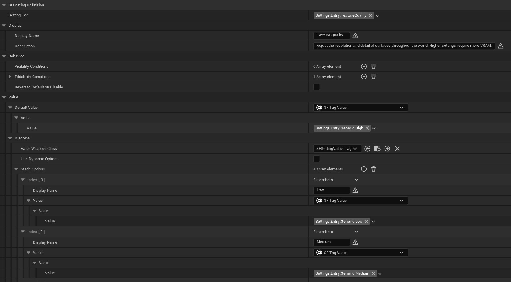
  <figcaption>A Discrete Setting with static options.</figcaption>
</figure>

* To define a category, In the Content Browser, right-click > **Miscellaneous** > **Data Asset** and select `SF Setting Category`. Similar to setting definitions, a category has an indentifying Category Tag, and a Display Name.
* The `Category Type` field has 2 options: Branch or Leaf. 
    * A Branch category contains other sub-categories. 
    * A Leaf category contains setting definitions. You can specify Setting Groups, which are purely presentational groupings with a display name. You can also just add all your setting definitions in the `Settings` array if you do not want to use groups. In this case, setting entries are displayed all in the same group.

<figure style="text-align: center;">
  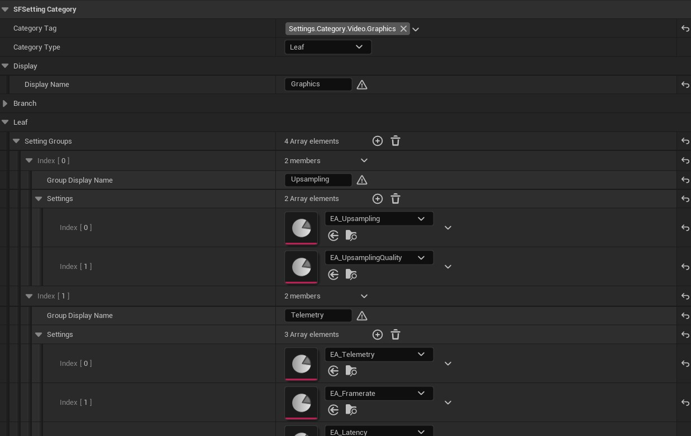
  <figcaption>A Leaf category with setting groups.</figcaption>
</figure>

* Lastly, to tie it all together, you need to specify a Settings Registry. In the Content Browser, right-click > **Miscellaneous** > **Data Asset** and select `SF Settings Registry`. The registry contains all your root categories. At initialization, the Settings Subsystem will traverse the categories down to the leaf level, gathering all setting definitions and load them asynchronously. In `WBP_SettingsScreen`, root categories are displayed as major tabs, and their subcategories are displayed as minor tabs.
* In order for the Settings Subsystem to find your Registry, go to **Edit** > **Project Settings** > **Settings Framework** and assign your registry asset to the `Settings Registry` field.
    * You may need to press **Set As Default** to prevent values from being reset between Editor sessions.
* Now your setting definitions are all set.

---

## 2 - Displaying the Settings Screen UI on Viewport

If you have an existing project using Common UI, you'll need to push `WBP_SettingsScreen` onto your `CommonActivatableWidgetStack` and activate it (either automatically by Common UI or through calling `ActivateWidget` manually). If you are starting with a blank projects, here are the steps to set it up:

* Make a widget Blueprint of type `CommonUserWidget` and name it `WBP_HUD`. This will be added to our viewport and act as the main container for widgets in our UI.
* In the `WBP_HUD`, add a `CommonActivatableWidgetStack`. Make it a variable and name it `Widget Stack`.
* Make a Blueprint of type `PlayerController` and name it `BP_PlayerController`. On Begin Play, set up some script to add `WBP_HUD` to the viewport and push `WBP_SettingsScreen` to its widget stack. Normally you would push `WBP_SettingsScreen` when the player performs an action to bring up the settings screen, but for the sake of simplicity, we'll set it up right at Begin Play since it is the only screen in this project.

<figure style="text-align: center;">
  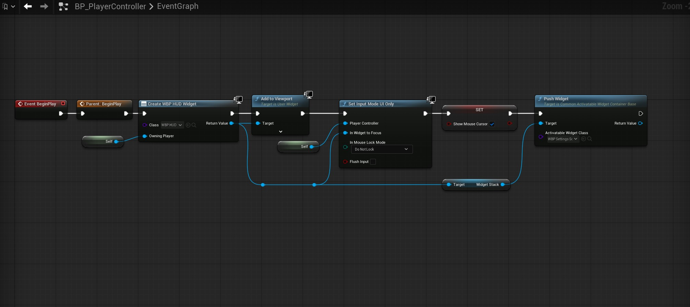
  <figcaption>Adding WBP_HUD and WBP_SettingsScreen to Viewport in BP_PlayerController.</figcaption>
</figure>

* Make a Blueprint of type `GameModeBase` and name it `BP_GameMode`. In its Details panel, assign our new `BP_PlayerController` as the new player controller class.
* We can use this new game mode active by making it the game mode of a specific level, or the default gamemode of the project. Go to **Edit > Project > Maps & Modes** and set the `Default Gamemode` to our `BP_GameMode`.
* For `WBP_SettingsScreen` to work correctly, we have to specify which component widgets it should use. Go to **Edit** > **Project Settings** > **Settings Framework** and assign the following:
    * Root Tab Button Class: `WBP_MajorTabButton`
    * Branch Tab Button Class: `WBP_MinorTabButton`
    * Branch Tab Content Class: `WBP_CategoryTab_Branch`
    * Leaf Tab Content Class: `WBP_CategoryTab_Leaf`
    * Setting Group Widget Class: `WBP_SettingGroup`
    * Setting Entry Widget Classes:
        * `SFSettingDefinition_Bool` -> `WBP_SettingEntry_Checkbox`
        * `SFSettingDefinition_Discrete` -> `WBP_SettingEntry_Rotator`
        * `SFSettingDefinition_Key` -> `WBP_SettingEntry_Keybind`
        * `SFSettingDefinition_Scalar` -> `WBP_SettingEntry_Slider`
    * You may need to press **Set As Default** to prevent values from being reset between Editor sessions.

<figure style="text-align: center;">
  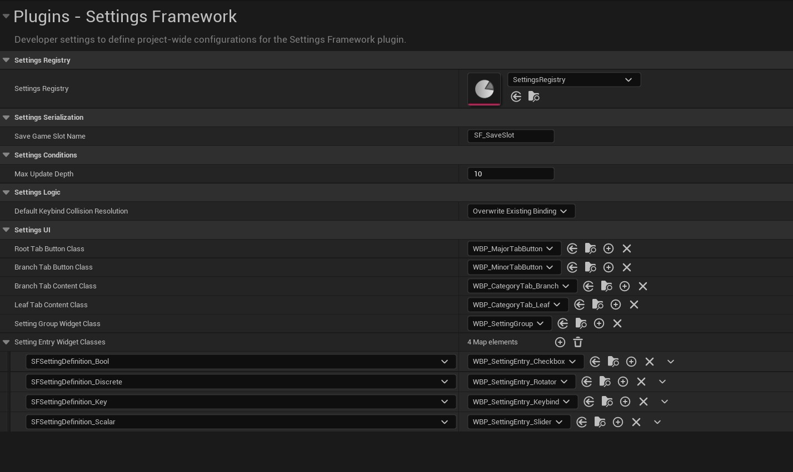
  <figcaption>Configured Developer Settings in Project Settings.</figcaption>
</figure>

* Now when we start the game, we'll see the settings screen, with all settings populated.

<figure style="text-align: center;">
  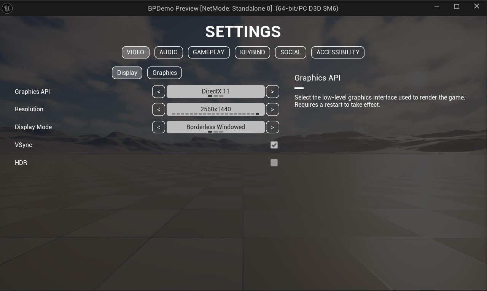
  <figcaption>Widget populated with settings.</figcaption>
</figure>

---

## 3 - Setting up Visibility and Editability Conditions

Settings can be configured to update their states dynamically at runtime through the `Visibility Conditions` and `Editability Conditions` fields in their definition data assets. In this guide's example, **Texture Quality** should only be user-editable if **Graphics Preset** is set to Custom.

* Make a Blueprint of type `SFSettingCondition` and name it `GraphicsPresetCustom`.
* In this Blueprint, override the function `IsConditionMet`. This function should return True if the condition is met, and False otherwise. The following is the example script for checking if **Graphics Preset** is set to Custom:

<figure style="text-align: center;">
  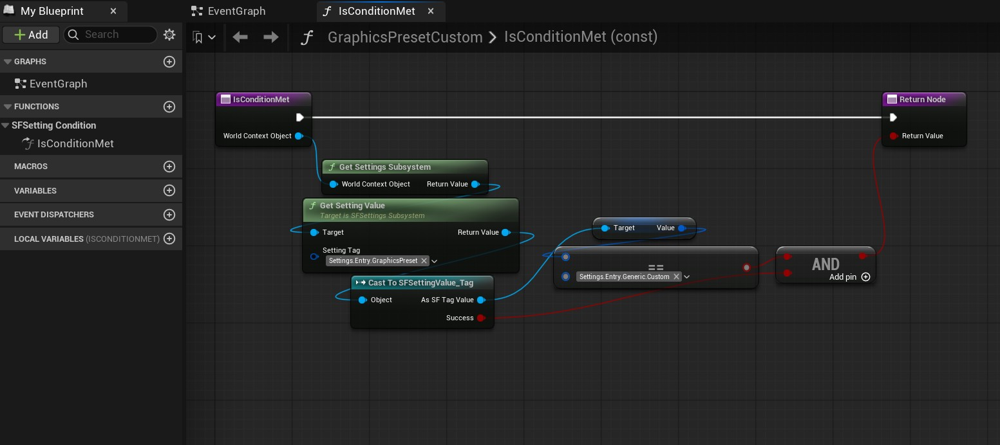
  <figcaption>Condition check for Graphics Preset being set to Custom.</figcaption>
</figure>

* After saving this condition Blueprint, we assign it to the appropriate setting definition data asset (`EA_TextureQuality` for the **Texture Quality** setting).
* Add an element to the `Editability Conditions` field, and assign the newly created `GraphicsPresetCustom` Blueprint to it. This is the collection of conditions evaluated to determine a setting's editability. The setting is disabled if any condition in the collection returns False. Similarly, the setting is hidden if any condition in the `Visibility Conditions` collection returns False.

<figure style="text-align: center;">
  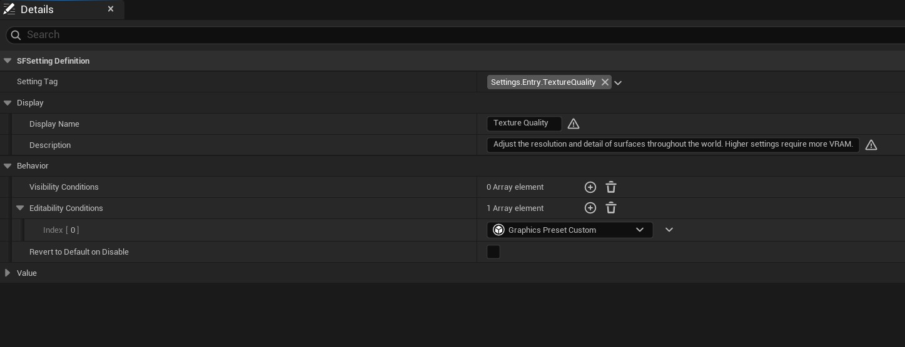
  <figcaption>The setting condition assigned in a setting data asset.</figcaption>
</figure>

* Now when we start the game, we'll see that **Texture Quality** is disabled when **Graphics Preset** is set to Low/Medium/High and only becomes customizable if it is set to Custom.

<figure style="text-align: center;">
  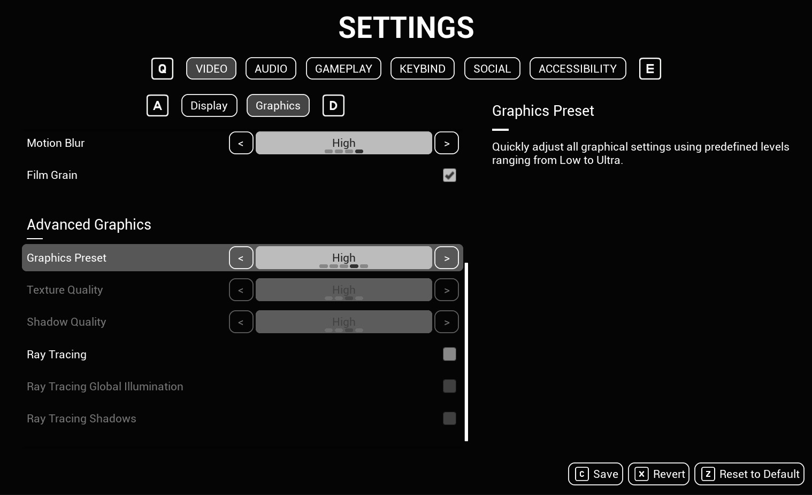
  <figcaption>Texture Quality is disabled when Graphics Preset is set to High.</figcaption>
</figure>

---

## 4 - Setting up Reactive Settings

In the previous section, we successfully disable (or hide) the **Texture Quality** setting when **Graphics Preset** is not set to Custom. However, when **Graphics Preset** is set to values such as Low/Medium/High, we also want **Texture Quality** to update to match. This can be done through the Settings Subsystem's API functions.

This should be implemented in the Blueprint that controls the specific setting's logic. The following steps were implemented in the Player Controller Blueprint for simplicity.

* At `Begin Play` or initialization, bind to the Settings Subsystem's `On Setting Value Changed` with a handler function. Optionally, call the handler function directly with the value of the determinant setting (**Graphics Preset** in this case)'s value to make sure the logic runs with its initial value.

<figure style="text-align: center;">
  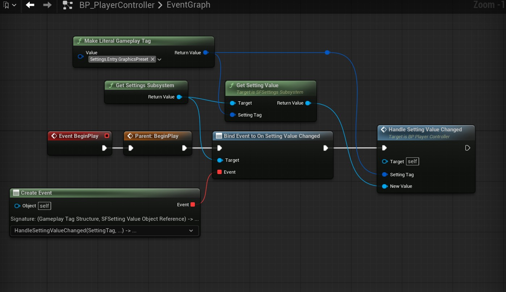
  <figcaption>Binding to Setting Value Changed at Begin Play.</figcaption>
</figure>

* In the handler function, set up a script that updates **Texture Quality** according to **Graphics Preset**'s value if it is not set to Custom. Save the Blueprint. The example handler logic is shown in the following screenshot:

<figure style="text-align: center;">
  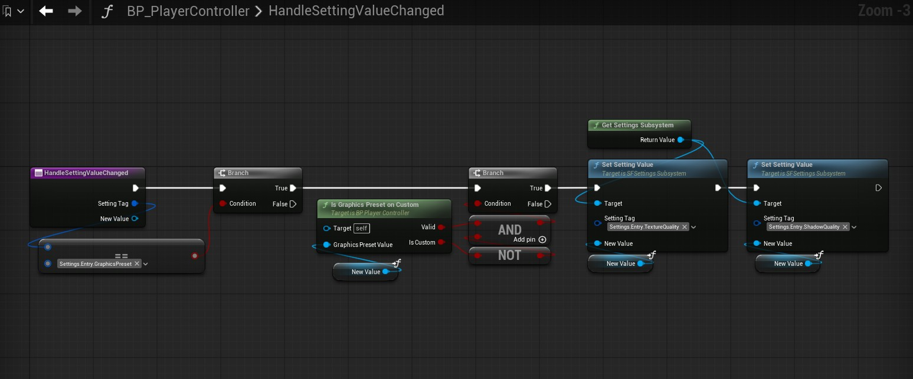
  <figcaption>Handler function logic to set reactive settings.</figcaption>
</figure>

<figure style="text-align: center;">
  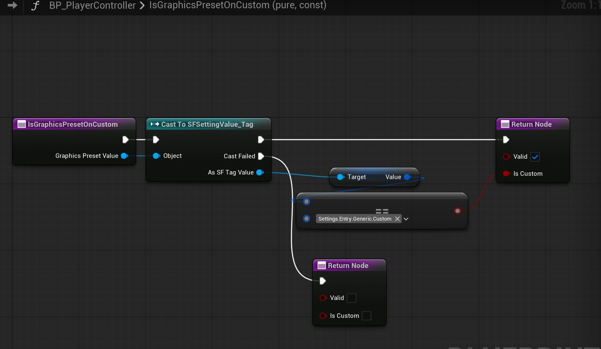
  <figcaption>Helper function to check if Graphics Preset is set to Custom.</figcaption>
</figure>

* Now when we start the game, we'll see that **Texture Quality** is updated according to **Graphics Preset**'s value when it is set to Low/Medium/High.

<figure style="text-align: center;">
  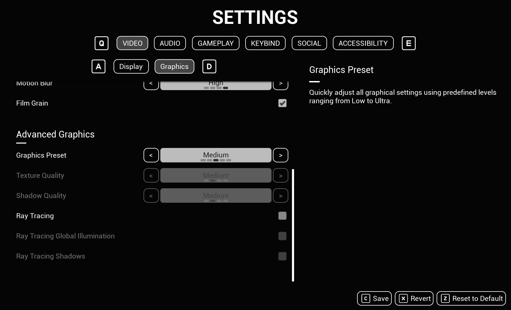
  <figcaption>Texture Quality is set according to Graphics Preset's value.</figcaption>
</figure>

---

## 5 - Setting up Runtime Dynamic Options

It is not always possible to specify selectable options at design time for discrete settings. For example, the **Resolution** setting should be populated with values supported by the monitor, and the **Audio Output Device** setting should be populated with a list of connected audio devices. This is where dynamic options come in. The following guide shows the process for evaluating and populating the options for the **Resolution** setting.

* Make a Blueprint of type `USFSettingOptionSource` and name it `ResolutionOptionSource`.
* In this Blueprint, override the function `Get Available Options`. This function should return an array of selectable options as `SFSettingOption` structs, which contains a localized `Display Name` and an underlying `SFSettingValue`, which can be of any defined data type. For `ResolutionOptionSource`, we retrieve the list of supported fullscreen resolutions and construct setting options from them. The script can be seen below:

[[ Screenshot of ResolutionOptionSource::GetAvailableOptions script. ]]

* Additionally, override the function `Get Default Value`. This function should return the `SFSettingValue` that corresponds to the setting option that the user should revert to upon hitting **Revert to Default**. The `ResolutionOptionSource` example returns the largest available resolution as the default value.

[[ Screenshot of ResolutionOptionSource::GetDefaultValue script. ]]

* Remember to mention calling RefreshOptions and GetSettingOptions manually.

---

## 6 - Setting up Common UI and Enhanced Input for Navigation and Keybind Widget

Common UI with Enhanced Input must be set up for the keybind widget and the built-in gamepad navigation to work. Here are the steps I took to set them up:

* Go to **Edit > Project Settings > Game > Common Input Settings** and set `Enable Enhanced Input Support` to True. Restart the Editor when prompted.
* In the Content Browser, right-click > **Input** > **Input Action** to make an Input Action Blueprint and name it `IA_UI_Confirm`. Make another one and name it `IA_UI_Back`. These are our basic yes/no actions.
* Make a Blueprint of type `CommonUIInputData` and name it `BP_InputData`. In its Details panel, set `Enhanced Input Click Action` to the new `IA_UI_Confirm` and `Enhanced Input Back Action` to `IA_UI_Back`.
* Go to **Edit > Project Settings > Game > Common Input Settings** and set `Input Data` to the new `BP_InputData`.
* Optionally, on the same screen, you can set up controller data assets in **Platform Input > Windows** (or your platform of choice) **> Default > Controller Data**. Controller Data helps you assign input key values to icons, which Common UI will use to display prompts for input action on the UI.
* Go to **Edit > Project Settings > Engine > General Settings** and set `Game Viewport Client Class` to `CommonGameViewportClient`.
* In the Content Browser, right-click > **Input** > **Input Mapping Context** to make an Input Mapping Context (IMC) and name it `IMC_DefaultUI`. In this Blueprint, add to the **Default Key Mappings** > **Mappings** the yes/no input actions from before (`IA_UI_Confirm` and `IA_UI_Back`) as well as the input actions that came with the plugin (`IA_UI_PrevTab_Major`, `IA_UI_NextTab_Major`, `IA_UI_PrevTab_Minor`, `IA_UI_NextTab_Minor`, `IA_UI_Save`, `IA_UI_Revert`, `IA_UI_ResetToDefault`). Assign your desired input keys to them.

<figure style="text-align: center;">
  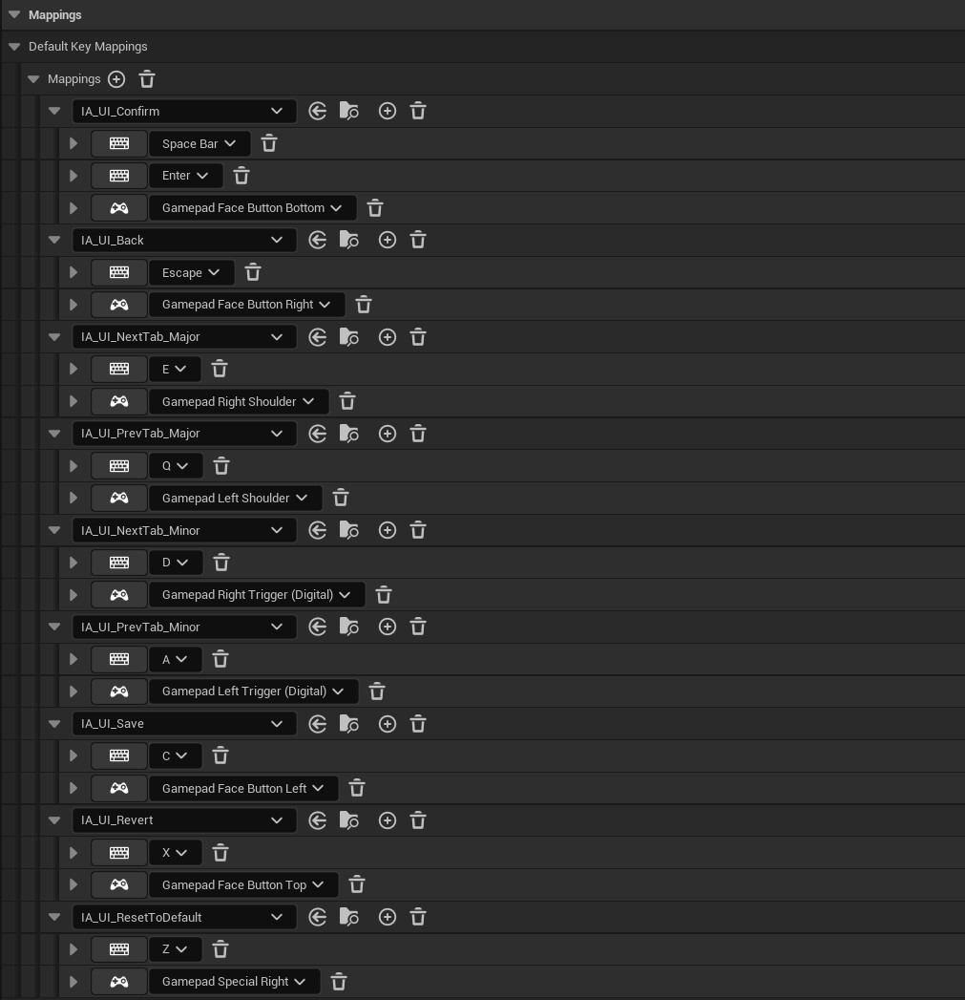
  <figcaption>Input Mapping Context populated.</figcaption>
</figure>

* When using Enhanced Input, we usually want to activate/deactivate IMCs at runtime (for example, switching between gameplay and UI mappings). However, in this project, we only have the UI screen, so we'll make it the default IMC. Go to **Edit > Project Settings > Engine > Enhanced Input** and add the new `IMC_DefaultUI` to `Default Mapping Contexts`.
* Now when we start the game, our assigned input keys should work to perform actions and action prompts should appear if controller data assets are set up.

<figure style="text-align: center;">
  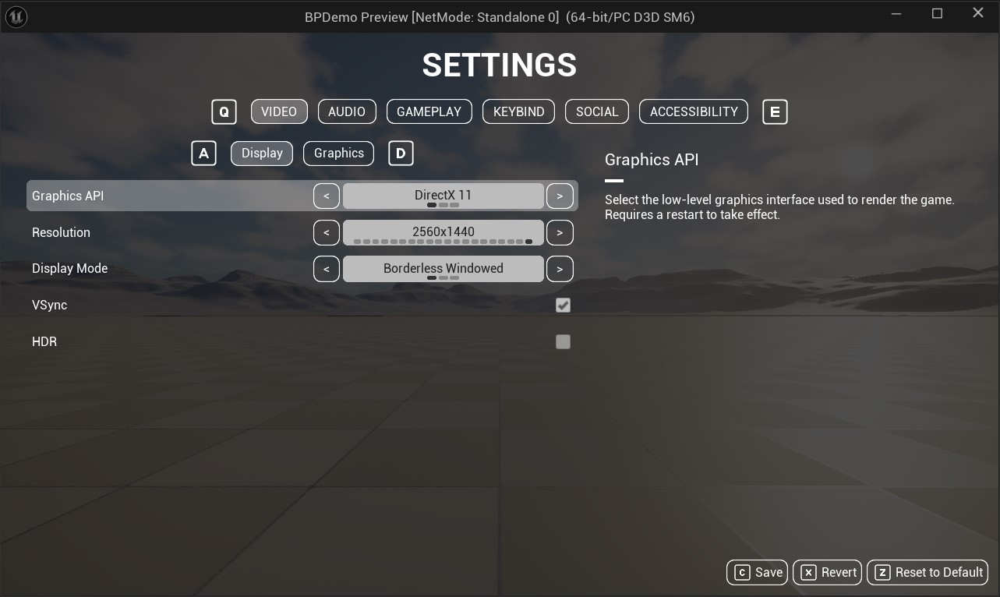
  <figcaption>Settings screen with functional navigation.</figcaption>
</figure>