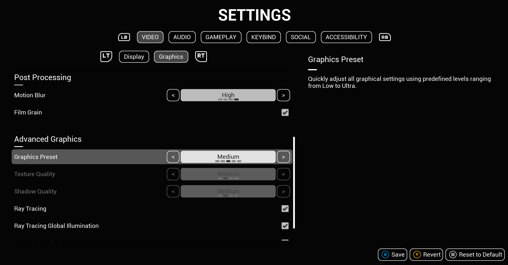
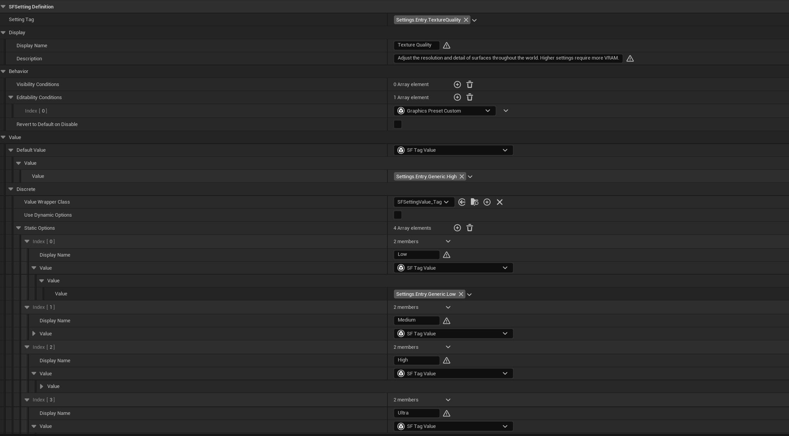

# Settings Framework

Settings Framework is a data-driven game settings management system with a ready-to-use CommonUI skeletal interface.

<figure style="text-align: center;">
  
  <figcaption>The provided WBP_SettingsScreen with settings and categories in the SFHost demo project.</figcaption>
</figure>

## 1 - Overview

Settings Framework is a comprehensive and modular Unreal Engine 5 plugin designed to decouple settings data from the UI layer. By utilizing Data Assets for configuration and a dedicated Subsystem for runtime management, it allows developers to spin up a settings management system and UI for their projects in minutes.

### Core Features
* **Data-Driven Design:** Define your setting definitions supporting various data types (boolean, scalar, discrete options, and keybind) and category hierarchies using Data Assets.
* **Automated State Management:** The Settings Subsystem automatically handles loading Data Assets at start up, managing setting values, and loading/saving from disk.
* **Keybinding Support:** Includes keybind collision detection based on collision channels and customizable resolution policies (Swap, Overwrite, Allow Duplicate).
* **Dynamic Conditions:** Easily configure condition logic to hide or disable specific settings based on runtime states.
* **Starter UI Widgets:** Built entirely on Epic's Common UI, the plugin includes a suite of fully navigable widgets that handle tabs, groups, and setting entries.

### Structure
The plugin is divided into three distinct layers:

1. **The Registry & Data Assets:** You define your settings and their metadata as Data Assets in the Editor.
2. **The Settings Subsystem:** The C++ backend reads the registry, loads the save file, and acts as the singular source of truth for setting values at runtime.
3. **The User Interface:** The UI simply listens to the Subsystem and visually represents the data, keeping the widgets clean and logic-free.

<figure style="text-align: center;">
  
  <figcaption>Configuring a discrete setting definition as a Data Asset in the Editor.</figcaption>
</figure>

---

## 2 - Documentation Quick Links

Guides to get the plugin up and running in your project:

* **[Requirements & Installation Guide](../installation/)**: Engine requirements, setup steps, and usage scenarios.
* **[Blueprint Guide](../blueprint/)**: Info on how to interact with the Settings Subsystem, and details about the included skeletal UI widgets.
* **[C++ API Reference](../api/)**: Full Doxygen-generated API documentation for native code extensions.

---

## 3 - Repositories & Examples

The source code for the plugin and a fully playable demonstration project are available on GitHub. Exploring the SFHost demo project is highly recommended to see exactly how the Data Assets and UI are configured.

* **[SettingsFramework Plugin Repository](https://github.com/apham4/SettingsFramework)**
* **[SFHost Demo Project](https://github.com/apham4/SFHost)**

---

## 4 - Support & Contact

If you encounter bugs or need technical assistance integrating the plugin into your project, please reach out via email:

**Support Email:** [phamquocanh2580@gmail.com](mailto:phamquocanh2580@gmail.com)